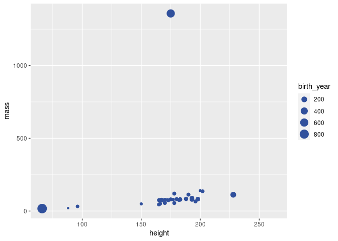

Visualizing Starwars characters
================
Mine Çetinkaya-Rundel

### Glimpse at the starwars data frame.

``` r
starwars
```

    ## # A tibble: 87 × 14
    ##    name     height  mass hair_color skin_color eye_color birth_year sex   gender
    ##    <chr>     <int> <dbl> <chr>      <chr>      <chr>          <dbl> <chr> <chr> 
    ##  1 Luke Sk…    172    77 blond      fair       blue            19   male  mascu…
    ##  2 C-3PO       167    75 <NA>       gold       yellow         112   none  mascu…
    ##  3 R2-D2        96    32 <NA>       white, bl… red             33   none  mascu…
    ##  4 Darth V…    202   136 none       white      yellow          41.9 male  mascu…
    ##  5 Leia Or…    150    49 brown      light      brown           19   fema… femin…
    ##  6 Owen La…    178   120 brown, gr… light      blue            52   male  mascu…
    ##  7 Beru Wh…    165    75 brown      light      blue            47   fema… femin…
    ##  8 R5-D4        97    32 <NA>       white, red red             NA   none  mascu…
    ##  9 Biggs D…    183    84 black      light      brown           24   male  mascu…
    ## 10 Obi-Wan…    182    77 auburn, w… fair       blue-gray       57   male  mascu…
    ## # … with 77 more rows, and 5 more variables: homeworld <chr>, species <chr>,
    ## #   films <list>, vehicles <list>, starships <list>

### Modify the following plot to change the color of all points to `"pink"`.

``` r
ggplot(starwars, 
       aes(x = height, y = mass, color = gender, size = birth_year)) +
  geom_point(color = "#30509C")
```

    ## Warning: Removed 51 rows containing missing values (geom_point).

<!-- -->

### Add labels for title, x and y axes, and size of points. Uncomment to see the effect.

``` r
ggplot(starwars, 
       aes(x = height, y = mass, color = gender, size = birth_year)) +
  geom_point(color = "#30509C") +
  labs(
    #title = "___",
    #x = "___", 
    #y = "___",
    #___
    )
```

    ## Warning: Removed 51 rows containing missing values (geom_point).

<!-- -->

### Pick a single categorical variable from the data set and make a bar plot of its distribution.

(A little bit of starter code is provided below, and the code chunk is
set to not be evaluated with `eval = FALSE` because the current code in
there is not valid code and hence the document wouldn’t knit. Once you
replace the code with valid code, set the chunk option to `eval = TRUE`,
or remove the `eval` option altogether since it’s set to `TRUE` by
default.)

``` r
ggplot(starwars, aes(___)) +
  geom___
```

### Pick a single numerical variable and make a histogram of it.

(This time no starter code is provided, you’re on your own!)

``` r
2+2
```

    ## [1] 4

### Pick a numerical variable and a categorical variable and make a visualisation (you pick the type!) to visualise the relationship between the two variables. Along with your code and output, provide an interpretation of the visualisation.

### Pick two categorical variables and make a visualisation to visualise the relationship between the two variables. Along with your code and output, provide an interpretation of the visualisation.

### Pick two numerical variables and two categorical variables and make a visualisation that incorportes all of them and provide an interpretation with your answer.
